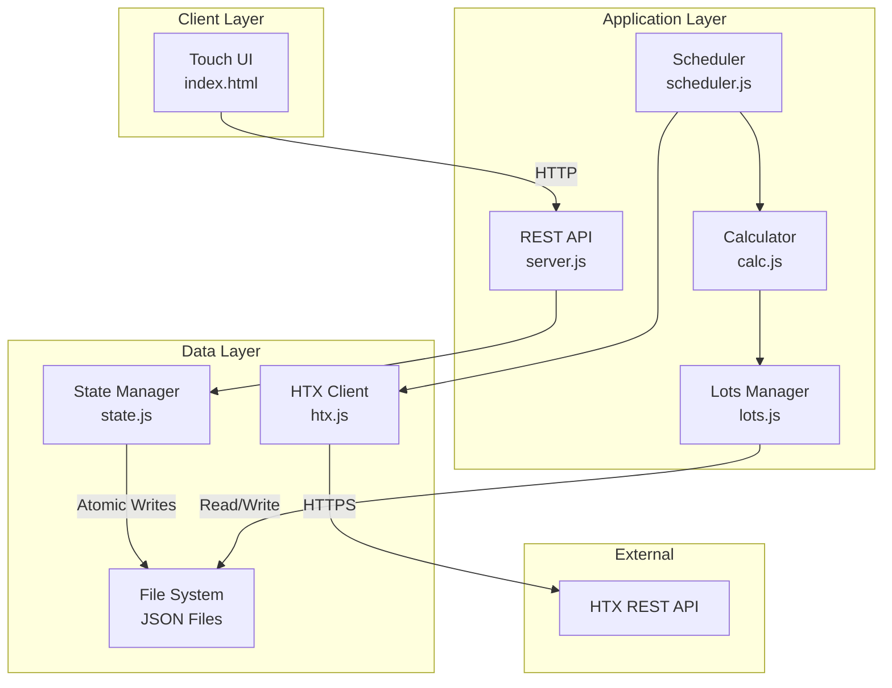

# HTX Pi Monitor — Implementation Specification v1.0

## Architecture Analysis

### System Context
A single-platform portfolio monitoring application designed for Raspberry Pi deployment, providing real-time asset valuation with P/L tracking against cost basis using LOFO (Lowest-First-Out) accounting. The system operates as a read-only monitor with manual cost basis management.

### Key Architectural Decisions
- **Monolithic Node.js application** (KISS principle - single deployment unit)
- **JSON file persistence** (YAGNI - no database needed for MVP)
- **Pull-based data synchronization** (simpler than WebSocket streams)
- **Client-side rendering** (reduces server load on Pi)
- **Sequential ID generation** (avoids UUID complexity)

---

## System Architecture

### Component Boundaries



### Data Flow Architecture

1. **Pull Flow**: Scheduler → HTX Client → State Manager → JSON Persistence
2. **Calculation Flow**: Raw Data → Lots Manager → Calculator → Enriched Snapshot
3. **Client Flow**: UI → REST API → State Manager → Cached Response

---

## Implementation Design

### Module Responsibilities (SOLID - Single Responsibility)

#### `src/server.js` - API Gateway
```javascript
// Core responsibilities:
// - Express middleware configuration (helmet, compression, morgan)
// - Static file serving from /public
// - REST endpoint routing
// - Error boundary for HTTP responses

const express = require('express');
const helmet = require('helmet');
const compression = require('compression');
const morgan = require('morgan');
const { getSnapshot, getHistory } = require('./state');

class Server {
    constructor(port = 8080, bindAddr = '0.0.0.0') {
        this.app = express();
        this.setupMiddleware();
        this.setupRoutes();
    }
    
    setupMiddleware() {
        this.app.use(helmet({
            contentSecurityPolicy: {
                directives: {
                    defaultSrc: ["'self'"],
                    scriptSrc: ["'self'", "'unsafe-inline'"],
                    styleSrc: ["'self'", "'unsafe-inline'"]
                }
            }
        }));
        this.app.use(compression());
        this.app.use(morgan('tiny'));
        this.app.use(express.static('public'));
        this.app.use(express.json());
    }
    
    setupRoutes() {
        this.app.get('/api/health', this.handleHealth.bind(this));
        this.app.get('/api/snapshot', this.handleSnapshot.bind(this));
        this.app.get('/api/history', this.handleHistory.bind(this));
        this.app.use(this.errorHandler);
    }
}
```

#### `src/htx.js` - Exchange Client (Adapter Pattern)
```javascript
// Encapsulates HTX API complexity
// Handles HMAC-SHA256 signing, rate limiting, error recovery

class HTXClient {
    constructor(accessKey, secretKey, accountId) {
        this.baseURL = 'https://api.huobi.pro';
        this.timeout = 10000;
        this.retryConfig = {
            maxRetries: 3,
            baseDelay: 1000,
            maxDelay: 30000
        };
    }
    
    async getBalances() {
        // Returns: { BTC: { free: 0.12, locked: 0 }, ... }
    }
    
    async getPrices(symbols) {
        // Returns: { BTC: { last: 62000, change24h: -1.2 }, ... }
    }
    
    sign(params) {
        // HMAC-SHA256 implementation
    }
    
    async retryWithBackoff(fn) {
        // Linear backoff: delay += baseDelay each retry
    }
}
```

#### `src/scheduler.js` - Orchestration Layer
```javascript
// Coordinates periodic data pulls and error recovery

class Scheduler {
    constructor(htxClient, stateManager, calculator, intervalMs = 60000) {
        this.isRunning = false;
        this.failureCount = 0;
        this.maxConsecutiveFailures = 5;
    }
    
    async pullCycle() {
        try {
            const balances = await this.htxClient.getBalances();
            const prices = await this.htxClient.getPrices(Object.keys(balances));
            const lotsData = await this.lotsManager.loadLots();
            
            const snapshot = this.calculator.computeSnapshot(
                balances, 
                prices, 
                lotsData
            );
            
            await this.stateManager.saveSnapshot(snapshot);
            this.failureCount = 0;
        } catch (error) {
            this.handleError(error);
        }
    }
    
    handleError(error) {
        this.failureCount++;
        const backoffMs = Math.min(
            this.failureCount * 30000, 
            300000 // max 5 minutes
        );
        console.error(`Pull failed, retry in ${backoffMs}ms:`, error.message);
    }
}
```

#### `src/state.js` - State Management (Repository Pattern)
```javascript
// In-memory cache with atomic JSON persistence

class StateManager {
    constructor(dataDir = './data', maxHistory = 50) {
        this.cache = { history: [] };
        this.statePath = path.join(dataDir, 'state.json');
        this.lockFile = null;
    }
    
    async saveSnapshot(snapshot) {
        this.cache.history.unshift(snapshot);
        this.cache.history = this.cache.history.slice(0, this.maxHistory);
        await this.atomicWrite(this.statePath, this.cache);
    }
    
    async atomicWrite(filepath, data) {
        const tmpPath = `${filepath}.tmp.${Date.now()}`;
        await fs.writeFile(tmpPath, JSON.stringify(data, null, 2));
        await fs.rename(tmpPath, filepath);
    }
    
    getLatestSnapshot() {
        return this.cache.history[0] || null;
    }
}
```

#### `src/calc.js` - Business Logic Layer
```javascript
// Pure functions for valuation and P/L calculations

class Calculator {
    computeSnapshot(balances, prices, lotsData) {
        const positions = [];
        let totalValue = 0;
        let weightedChange = 0;
        
        for (const [symbol, balance] of Object.entries(balances)) {
            const price = prices[symbol]?.last || 0;
            const value = balance.free * price;
            const avgCost = this.getAverageCost(symbol, lotsData);
            const pnlPct = avgCost ? ((price / avgCost - 1) * 100) : null;
            
            positions.push({
                symbol,
                free: balance.free,
                price,
                value,
                day_pct: prices[symbol]?.change24h || 0,
                pnl_pct: pnlPct,
                unreconciled: this.checkReconciliation(balance.free, lotsData[symbol])
            });
            
            totalValue += value;
            weightedChange += value * (prices[symbol]?.change24h || 0);
        }
        
        return {
            time: Math.floor(Date.now() / 1000),
            ref_fiat: 'USD',
            total_value_usd: totalValue,
            total_change_24h_pct: totalValue ? (weightedChange / totalValue) : 0,
            positions
        };
    }
    
    getAverageCost(symbol, lotsData) {
        const lots = lotsData[symbol]?.lots || [];
        const validLots = lots.filter(lot => lot.unit_cost !== null);
        
        if (validLots.length === 0) return null;
        
        const totalQty = validLots.reduce((sum, lot) => sum + lot.qty, 0);
        const totalCost = validLots.reduce((sum, lot) => sum + (lot.qty * lot.unit_cost), 0);
        
        return totalQty > 0 ? (totalCost / totalQty) : null;
    }
}
```

#### `src/lots.js` - LOFO Accounting Engine
```javascript
// Manages cost basis lots with LOFO deduction

class LotsManager {
    constructor(dataDir = './data') {
        this.lotsPath = path.join(dataDir, 'cost_basis_lots.json');
    }
    
    async loadLots() {
        try {
            const data = await fs.readFile(this.lotsPath, 'utf8');
            return JSON.parse(data);
        } catch (error) {
            return { meta: { last_id: 0 } };
        }
    }
    
    nextId(meta) {
        meta.last_id = (meta.last_id || 0) + 1;
        return String(meta.last_id).padStart(6, '0');
    }
    
    applyEntry(lotsData, symbol, entry) {
        if (!lotsData[symbol]) {
            lotsData[symbol] = { lots: [] };
        }
        
        const { action, qty, unit_cost, ts } = entry;
        const id = this.nextId(lotsData.meta);
        
        switch (action) {
            case 'buy':
            case 'deposit':
                lotsData[symbol].lots.push({ id, action, qty, unit_cost, ts });
                break;
                
            case 'sell':
            case 'withdraw':
                this.deductLOFO(lotsData[symbol].lots, qty);
                lotsData[symbol].lots.push({ id, action, qty: -qty, ts });
                break;
        }
    }
    
    deductLOFO(lots, qtyToDeduct) {
        // Sort by unit_cost ascending (null treated as Infinity)
        lots.sort((a, b) => {
            const costA = a.unit_cost ?? Infinity;
            const costB = b.unit_cost ?? Infinity;
            return costA - costB;
        });
        
        let remaining = qtyToDeduct;
        for (let i = 0; i < lots.length && remaining > 0; i++) {
            const lot = lots[i];
            if (lot.qty <= 0) continue;
            
            const deducted = Math.min(lot.qty, remaining);
            lot.qty -= deducted;
            remaining -= deducted;
        }
        
        // Remove depleted lots
        return lots.filter(lot => lot.qty > 1e-12);
    }
}
```

---

## Technology Stack

### Core Dependencies
```json
{
  "dependencies": {
    "express": "^4.19.0",
    "axios": "^1.7.0",
    "dotenv": "^16.4.0",
    "helmet": "^7.1.0",
    "compression": "^1.7.4",
    "morgan": "^1.10.0"
  },
  "devDependencies": {
    "nodemon": "^3.1.0"
  },
  "engines": {
    "node": ">=20.0.0"
  }
}
```

### Technology Rationale

| Component | Choice | Rationale |
|-----------|--------|-----------|
| Runtime | Node.js 20+ | Native async/await, stable on ARM64 |
| Framework | Express | Minimal, battle-tested, extensive middleware |
| HTTP Client | Axios | Built-in retry, timeout, interceptors |
| Security | Helmet | OWASP headers out-of-the-box |
| Persistence | JSON files | Simple, human-readable, sufficient for MVP |
| Process Manager | systemd | Native to Raspberry Pi OS |

---

## Implementation Strategy

### Phase 1: Core Foundation (Days 1-2)
1. Project setup and environment configuration
2. HTX client with signing implementation
3. Basic state management with atomic writes
4. Health check endpoint

### Phase 2: Data Pipeline (Days 3-4)
1. Scheduler with error recovery
2. Calculator for basic valuation
3. Snapshot generation and storage
4. API endpoints for snapshot/history

### Phase 3: Cost Basis (Days 5-6)
1. Lots manager with LOFO logic
2. P/L calculation integration
3. Reconciliation checks
4. Test with sample data

### Phase 4: UI Integration (Days 7-8)
1. Static file serving setup
2. Touch UI deployment
3. Auto-refresh implementation
4. Kiosk mode configuration

### Phase 5: Hardening (Days 9-10)
1. Error recovery testing
2. Performance optimization
3. Logging enhancement
4. Documentation completion

---

## Critical Implementation Details

### Atomic File Operations
```javascript
// Prevent corruption on power loss
async function atomicWrite(filepath, data) {
    const tmpPath = `${filepath}.tmp.${Date.now()}`;
    const content = JSON.stringify(data, null, 2);
    
    // Write to temp file
    await fs.promises.writeFile(tmpPath, content, { flag: 'w' });
    
    // Ensure data is flushed to disk
    const fd = await fs.promises.open(tmpPath, 'r+');
    await fd.sync();
    await fd.close();
    
    // Atomic rename
    await fs.promises.rename(tmpPath, filepath);
}
```

### HMAC-SHA256 Signing
```javascript
const crypto = require('crypto');

function signRequest(params, secretKey) {
    const sortedParams = Object.keys(params)
        .sort()
        .map(key => `${key}=${encodeURIComponent(params[key])}`)
        .join('&');
    
    const meta = `${method}\n${hostname}\n${path}\n${sortedParams}`;
    const hash = crypto.createHmac('sha256', secretKey);
    hash.update(meta);
    return hash.digest('base64');
}
```

### LOFO Implementation
```javascript
function deductLOFO(lots, qtyToDeduct) {
    // Create working copy
    const workingLots = [...lots];
    
    // Sort by cost (cheapest first)
    workingLots.sort((a, b) => {
        const costA = a.unit_cost ?? Number.MAX_SAFE_INTEGER;
        const costB = b.unit_cost ?? Number.MAX_SAFE_INTEGER;
        return costA - costB;
    });
    
    let remaining = qtyToDeduct;
    const result = [];
    
    for (const lot of workingLots) {
        if (remaining <= 0) {
            result.push(lot);
            continue;
        }
        
        if (lot.qty <= remaining) {
            // Fully consume this lot
            remaining -= lot.qty;
        } else {
            // Partially consume
            result.push({
                ...lot,
                qty: lot.qty - remaining
            });
            remaining = 0;
        }
    }
    
    // Filter out depleted lots
    return result.filter(lot => lot.qty > 1e-12);
}
```

---

## Validation & Testing Strategy

### Unit Test Coverage
```javascript
// test/lots.test.js
describe('LOFO Deduction', () => {
    test('deducts from lowest cost first', () => {
        const lots = [
            { id: '000001', qty: 0.10, unit_cost: 60000 },
            { id: '000002', qty: 0.20, unit_cost: 55000 }
        ];
        
        const result = deductLOFO(lots, 0.15);
        
        expect(result).toEqual([
            { id: '000001', qty: 0.10, unit_cost: 60000 },
            { id: '000002', qty: 0.05, unit_cost: 55000 }
        ]);
    });
    
    test('handles null unit_cost as infinity', () => {
        const lots = [
            { id: '000001', qty: 0.10, unit_cost: null },
            { id: '000002', qty: 0.20, unit_cost: 55000 }
        ];
        
        const result = deductLOFO(lots, 0.15);
        
        expect(result).toEqual([
            { id: '000001', qty: 0.10, unit_cost: null },
            { id: '000002', qty: 0.05, unit_cost: 55000 }
        ]);
    });
});
```

### Integration Test Scenarios

1. **Power Loss Recovery**
   - Kill process during JSON write
   - Verify data integrity on restart
   - Check atomic write implementation

2. **API Failure Handling**
   - Simulate 429 rate limits
   - Test 5xx server errors
   - Verify backoff behavior

3. **Data Reconciliation**
   - Create intentional mismatches
   - Verify unreconciled flags
   - Test UI warning display

4. **Performance Baseline**
   - Load with 100 positions
   - Measure response times < 100ms
   - Memory usage < 100MB

---

## Security Considerations

### API Key Management
```javascript
// Never log sensitive data
function redactKeys(config) {
    return {
        ...config,
        HTX_ACCESS_KEY: config.HTX_ACCESS_KEY ? '***' : undefined,
        HTX_SECRET_KEY: config.HTX_SECRET_KEY ? '***' : undefined
    };
}

console.log('Starting with config:', redactKeys(process.env));
```

### Network Security
- Bind to 127.0.0.1 for kiosk-only mode
- Use helmet for security headers
- No external authentication (LAN trust model)
- Read-only API keys mandatory

---

## Performance Optimization

### Caching Strategy
- In-memory snapshot cache (no disk I/O on reads)
- 30-second client-side cache
- Conditional requests with ETag support

### Resource Constraints (Raspberry Pi)
- Single-threaded execution (no worker threads needed)
- Memory limit: 100MB heap size
- CPU throttling: max 1 pull cycle concurrent
- Disk I/O: batch writes, minimize frequency

---

## Deployment Configuration

### systemd Service
```ini
[Unit]
Description=HTX Pi Monitor
After=network.target

[Service]
Type=simple
User=pi
WorkingDirectory=/home/pi/raspi-htx-monitor
ExecStart=/usr/bin/node src/server.js
Restart=on-failure
RestartSec=10
StandardOutput=append:/var/log/htx-monitor.log
StandardError=append:/var/log/htx-monitor.log

[Install]
WantedBy=multi-user.target
```

### Kiosk Mode Setup
```bash
#!/bin/bash
# /home/pi/start-kiosk.sh

# Disable screen blanking
xset s off
xset -dpms
xset s noblank

# Start monitor service
systemctl start htx-monitor

# Wait for service
sleep 5

# Launch Chromium in kiosk mode
chromium-browser \
    --kiosk \
    --incognito \
    --disable-pinch \
    --overscroll-history-navigation=0 \
    http://localhost:8080
```

---

## Next Actions

### Immediate Steps
1. ✅ Initialize project structure with package.json
2. ✅ Implement HTX client with signing
3. ✅ Create state manager with atomic writes
4. ✅ Set up Express server with health endpoint

### Validation Points
1. Manual test of HTX API connection
2. Verify atomic write under load
3. Test LOFO calculation accuracy
4. Validate touch UI on actual Pi hardware

### Documentation Requirements
1. API documentation with examples
2. Deployment guide for Raspberry Pi
3. Troubleshooting guide
4. Cost basis entry examples

---

## Risk Mitigation

| Risk | Impact | Mitigation |
|------|--------|------------|
| API rate limiting | Data staleness | Adaptive backoff, caching |
| Power loss corruption | Data loss | Atomic writes, journaling |
| Memory leak | Service crash | Heap monitoring, auto-restart |
| Time sync issues | Auth failures | NTP configuration, ±5s tolerance |
| Network instability | Missing updates | Retry logic, offline detection |

---

## Conclusion

This implementation specification provides a pragmatic, KISS-compliant architecture for the HTX Pi Monitor. The design prioritizes simplicity, reliability, and maintainability while meeting all functional requirements. The modular structure follows SOLID principles, enabling future enhancements without architectural refactoring.

Key success factors:
- Simple JSON persistence (no database complexity)
- Robust error handling with graceful degradation
- Touch-optimized UI with minimal server load
- Clear separation of concerns across modules
- Atomic operations for data integrity

The system is ready for implementation with clear boundaries, testable components, and a phased delivery approach.